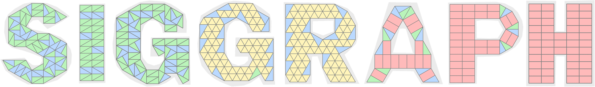
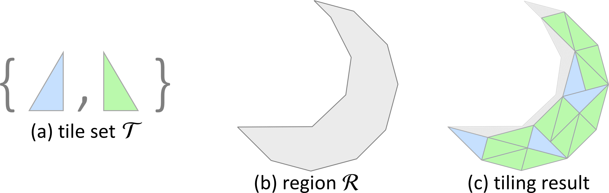

### We are refactoring our code and adding documentation, to improve the clarification. Please wait for a few more days :)

# TilinGNN
TilinGNN: Learning to Tile with Self-Supervised Graph Neural Network (SIGGRAPH 2020)
[Project page](https://appsrv.cse.cuhk.edu.hk/~haoxu/projects/TilinGnn/index.html)

### About
The goal of our research problem is illustrated below: given a tile set (a) and a 2D region to be filled (b), we aim to produce a tiling (c) that maximally covers the interior of the given region without overlap or hole between the tile instances.

### Dependencies:
- [Pytorch](https://pytorch.org/get-started/locally/)
- [Shapely](https://pypi.org/project/Shapely/)
- [Pytorch Geometric](https://pytorch-geometric.readthedocs.io/en/latest/notes/installation.html)
- [PyQT5](https://pypi.org/project/PyQt5/)
- [Minizinc](https://pypi.org/project/minizinc/) [Optional, install it only when you use IP solvers]

### Usage
We have the following entries for you to experience this project:
- **Tiling Design by UI interface**: From file `Tiling-GUI.py`, you can use our interface to draw a tiling region, and preview the tiling result interactively.  
- **Tiling a Region of Silhouette Image**: From file `Tiling-Shape`, you can use our pre-trained models, or IP solver, to solve a tiling problem by specifying a tiling region (from silhouette image) and a tile set.
- **Training for New Tile Sets**: You need the following steps to train a network for a new tile set. 
    (1) Following the file organization of existing tile sets inside the `data` folder, create new folder and new files to describe your new tile sets. You also need to edit configuration file `inputs/config.py` to add your new tile set.
    (2) Create a superset of candidate tile placements by running file `tiling/gen_complete_super_graph.py`, the generated files will be stored in the folder you created in Step (1).
    (3) Generate training data of random shapes by running `solver/ml_solver/gen_data.py`, the data will be stored in the path recorded in file `inputs/config.py`.
    (4) Start network training by running file `solver/ml_solver/network_train.py`.
